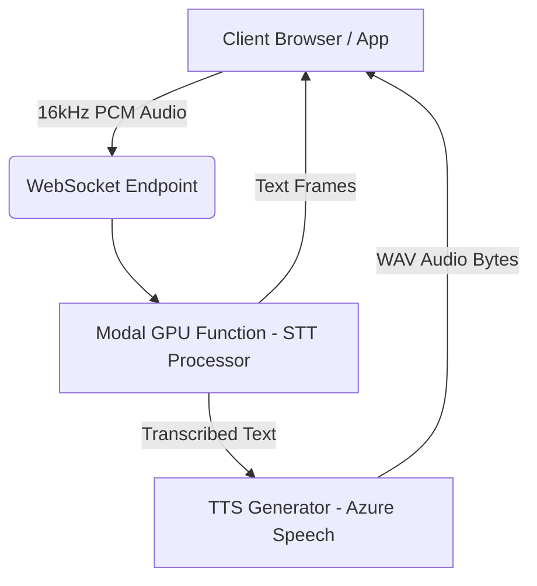

# 🎙️ Voiceassist-API


This repository hosts a high-performance, real-time Speech-to-Text (STT) and Text-to-Speech (TTS) backend powered by **Modal**. It is designed to handle streaming audio input and provide instant transcription and voice responses in **Kenyan English** and **Swahili**.

---

## 🏗️ Architecture & Models

### Speech-to-Text (STT)

The system uses fine-tuned variants of OpenAI's Whisper (Medium) architecture, specifically optimized for non-standard dialects:

* **English Model:** `Veronica1NW/en_whisper_nonstandard_medium`
* **Swahili Model:** `Veronica1NW/sw_whisper_nonstandard_medium`

### Text-to-Speech (TTS)

Audio responses are generated using **Azure Cognitive Services Speech SDK**, utilizing high-quality Neural voices specific to the region.

### Infrastructure

* **Host:** [Modal](https://modal.com)
* **Hardware:** NVIDIA L4 GPU
* **Timeout:** Sessions have a **strict 30-minute limit**. After 30 minutes, the WebSocket will disconnect, and the client must initiate a new connection.

---

## 🗺️ System Architecture Diagram



---

## 🌍 Supported Languages & Voices

The backend supports dynamic switching between languages and genders during the stream.

| Language             | Code | Gender | Azure Voice ID         |
| :------------------- | :--- | :----- | :--------------------- |
| **English (Kenyan)** | `en` | Male   | `en-KE-ChilembaNeural` |
| **English (Kenyan)** | `en` | Female | `en-KE-AsiliaNeural`   |
| **Swahili (Kenyan)** | `sw` | Male   | `sw-KE-RafikiNeural`   |
| **Swahili (Kenyan)** | `sw` | Female | `sw-KE-ZuriNeural`     |

---

## 🔌 Connectivity

### Endpoints

* **Web Endpoint:** `https://veronicahwags-cdli--streaming-whisper-whisperasr-web.modal.run`
* **WebSocket URL:** `wss://veronicahwags-cdli--streaming-whisper-whisperasr-web.modal.run/ws`

### Authentication

⚠️ **API Key Required**: This backend is protected. You must provide a valid `auth_token` in the initial JSON configuration message immediately upon connecting. Please request an API key from the administrator.

---

## 💻 Client Implementation Guide

### 1. Connection Setup (JavaScript)

```javascript
const WS_URL = "wss://veronicahwags-cdli--streaming-whisper-whisperasr-web.modal.run/ws";
const ws = new WebSocket(WS_URL);
ws.binaryType = 'arraybuffer'; // Essential for receiving audio bytes
```

### 2. Initial Configuration (Handshake)

Immediately after the WebSocket opens, you **must** send a JSON string containing your authentication token and initial settings.

```javascript
ws.onopen = () => {
    const config = {
        auth_token: "YOUR_API_KEY_HERE",
        lang: "en",       // "en" or "sw"
        mode: "audio+text", // "text" or "audio+text"
        gender: "female"  // "male" or "female"
    };
    ws.send(JSON.stringify(config));
};
```

### 3. Audio Input Specifications (Sending Data)

The model expects raw PCM audio data sent as binary messages.

* **Format:** 16-bit PCM (Int16)
* **Sample Rate:** 16,000 Hz (16kHz)
* **Channels:** Mono (1 channel)
* **Chunk Size:** Recommended **4096 bytes** per frame.
* **Data Type:** ArrayBuffer / Blob.

**Note:** Ensure you downsample microphone input (usually 44.1kHz or 48kHz) to **16kHz** before sending to save bandwidth and match model expectations.

### 4. Handling Responses

The backend sends two types of messages:

1. **Text Data (JSON/String):** Contains the transcription or status updates.

   ```json
   {
       "type": "config_updated",
       "lang": "sw",
       "mode": "audio+text",
       "gender": "male"
   }
   ```

   Or raw transcription strings:

   ```
   "Hello, how are you?"
   ```

2. **Binary Data (ArrayBuffer):** Contains the TTS audio (WAV format) generated by Azure.

---

## ⚠️ Important UX Note: Handling Audio Playback

When using **`audio+text` mode**, the backend will send audio bytes back to the client.

**CRITICAL:** Do **not** automatically play the received audio if the user's microphone is still active/open.

### 1. The Problem

If the AI voice plays while the microphone is listening, the microphone will pick up the AI's voice. The backend will hear itself, transcribe it, and respond to itself, causing a feedback loop.

### 2. The Solution

* Disable the microphone when audio is received.
* Provide a **"Play Response" button**.
* Or implement echo cancellation.

---

## 🔄 Switching Modes Runtime

You can switch languages or voices mid-stream by sending a new text frame with the JSON config:

```javascript
ws.send(JSON.stringify({
    lang: "sw",
    gender: "male"
}));
```
